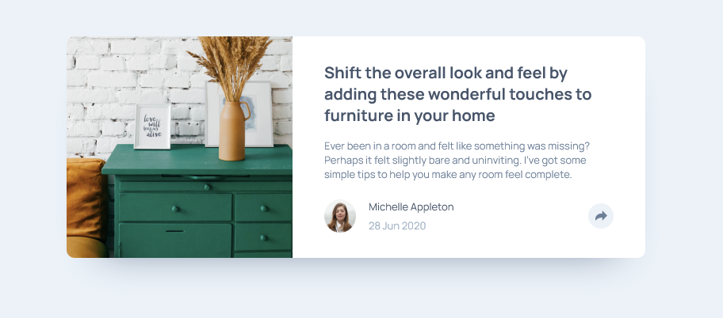

# Frontend Mentor - Article Preview Component Solution

This is a solution to the [Article preview component challenge on Frontend Mentor](https://www.frontendmentor.io/challenges/article-preview-component-dYBN_pYFT). Frontend Mentor challenges help you improve your coding skills by building realistic projects.

## Table of Contents

-   [Overview](#overview)
    -   [The challenge](#the-challenge)
    -   [Screenshot](#screenshot)
    -   [Links](#links)
-   [My Process](#my-process)
    -   [Built with](#built-with)
    -   [What I Learned](#what-i-learned)
    -   [Continued Development](#continued-development)
    -   [Useful Resources](#useful-resources)
-   [Author](#author)
-   [Acknowledgments](#acknowledgments)

## Overview

This simple project was easy to build. It is an article about how to decorate a home. I could have used **display grid** for the card layout but opted for **display flex**, which required a few extra `<div>` elements in the HTML. The CSS selectors are organized hierarchically. In JavaScript, I accessed elements by their IDs to prevent conflicts. I created the share icons in HTML, styled them in CSS, and made them appear/disappear using JavaScript events with **display flex**, **display block**, and **display none** applied to the tags.

### The Challenge

Users should be able to:

-   View the optimal layout for the component depending on their device's screen size.
-   See the social media share links when they click the share icon.

### Screenshot

  
  
  


## My Process

The process was straightforward. When I reviewed the project, I chose to use **display flex** (with the help of Figma). I started by structuring the HTML from the macro to the micro level. Then, I added classes to the tags to facilitate styling. Styling was also simple. The one thing I had to research (since it’s only the second time I’ve done it) was the arrow for the share box. It’s a really fun styling trick.

### Built with

-   Semantic HTML5 markup
-   CSS custom properties
-   JavaScript

### What I Learned

Using **`matchMedia()`** was new to me. It helps with responsive media queries. The parameter inside the parentheses and quotes can be `min-width` or `max-width`, as described in the W3Schools article. The `.matches` property checks if the condition is true, verifying whether the viewport matches the specified `max-width`, and returns a boolean value.

```javascript
const mediaQuery = window.matchMedia("(max-width: 375px)");

iconShare.addEventListener("click", function () {
    boxShareFirst.style.display = "block";
    iconShareClicked.style.display = "block";

    if (mediaQuery.matches) {
        boxShareResponsiveFirst.style.display = "flex";
        boxShareFirst.style.display = "none";
        boxProfile.style.display = "none";
        iconShareClicked.style.display = "none";
    }
});
```

### Continued development

I’ve learned CSS and HTML. My next steps are to finish learning JavaScript and start working with APIs.

## Author

-   instragam - [@fred_alves23](https://www.instagram.com/fred_alves23/)
-   Frontend Mentor - [@barislideri](https://www.frontendmentor.io/profile/barislideri)
-   Twitter - [@FredericoGA70](https://x.com/FredericoGA70)
